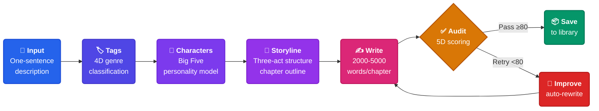
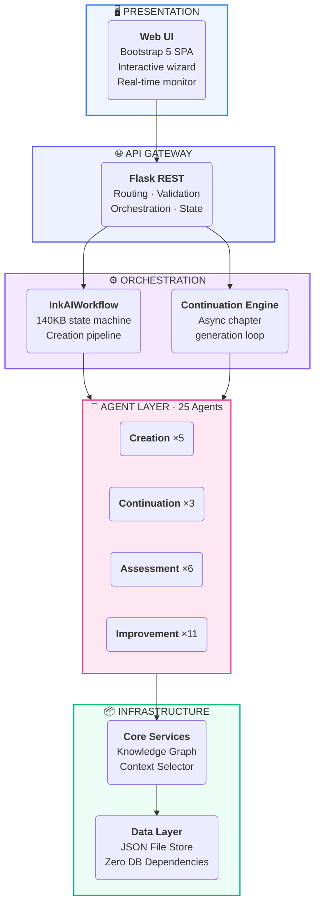
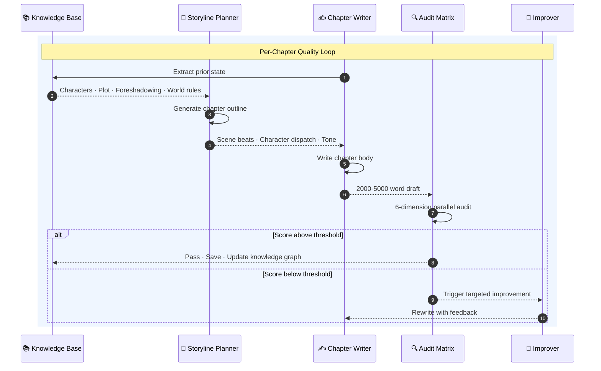

<br>

<div align="center">

<a href="#"></a>

<br>

<picture>
  <source media="(prefers-color-scheme: dark)" srcset="https://img.shields.io/badge/AI_x_Novel_Generation-25_Agents_%C2%B7_5_Stages_%C2%B7_6_Dimensions-3B82F6?style=for-the-badge&labelColor=0F172A" />
  
</picture>

<br>
<br>

<table>
<tr>
<td align="center" width="160"><b style="font-size:28px">25</b><br><sub>Agents</sub></td>
<td align="center" width="160"><b style="font-size:28px">5</b><br><sub>Pipeline Stages</sub></td>
<td align="center" width="160"><b style="font-size:28px">6D</b><br><sub>Quality Audit</sub></td>
<td align="center" width="160"><b style="font-size:28px">70+</b><br><sub>Genre Tags</sub></td>
<td align="center" width="160"><b style="font-size:28px">∞</b><br><sub>Chapter Continuation</sub></td>
</tr>
</table>

<br>

<a href="#quickstart"></a>
&nbsp;
<a href="#architecture"></a>
&nbsp;
<a href="#api"></a>

</div>

---

<div align="center">

### &nbsp;&nbsp;🎯 A Complete AI Novel Writing Factory&nbsp;&nbsp;

</div>

**InkAI** is not an "AI autocomplete" tool. It is a full-stack fiction generation framework.

Give it *one sentence* — "I want to write an urban suspense thriller" — and 25 specialized AI agents spring into action. They analyze your intent, recommend genre tags, design characters with psychological depth (Big Five personality model), construct a three-act narrative architecture, write chapter after chapter at 2,000-5,000 words each, and then audit every output across 6 quality dimensions — rewriting anything that falls below the 80-point threshold. The result is a coherent, consistent long-form novel with proper foreshadowing, character arcs, and world-building.

---



---

<div id="architecture"></div>

<div align="center">

### &nbsp;&nbsp;🏗 System Architecture&nbsp;&nbsp;

</div>



---

<div align="center">

### &nbsp;&nbsp;🔄 Intelligent Continuation Engine&nbsp;&nbsp;

</div>



<table align="center">
<tr>
<td align="center" width="150"><b>Character<br/>Consistency</b><br/><sub>Behavior · Voice<br/>Arc trajectory</sub></td>
<td align="center" width="150"><b>Plot<br/>Logic</b><br/><sub>Causality · No holes<br/>Closure</sub></td>
<td align="center" width="150"><b>World<br/>Coherence</b><br/><sub>Rules · Setting<br/>Continuity</sub></td>
<td align="center" width="150"><b>Style<br/>Fidelity</b><br/><sub>Tone · Narrative<br/>Pacing</sub></td>
<td align="center" width="150"><b>Reader<br/>Experience</b><br/><sub>Tension · Emotion<br/>Readability</sub></td>
<td align="center" width="150"><b>Long-Term<br/>Threads</b><br/><sub>Cross-volume clues<br/>Grand finale</sub></td>
</tr>
</table>

---

<div id="quickstart"></div>

<div align="center">

### &nbsp;&nbsp;⚡ Quick Start&nbsp;&nbsp;

</div>

```bash
git clone https://github.com/yan2959088709/InkAI-.git
cd InkAI-
pip install -r requirements.txt
```

Edit `config.py` with your API credentials, then:

```bash
python start_web.py
# → Open http://localhost:5000
```

<table align="center">
<tr>
<td align="center" width="300"><b>API_KEY</b><br/><sub>Zhipu AI GLM-4.5-flash</sub></td>
<td align="center" width="300"><b>BASE_URL</b><br/><sub>OpenAI-compatible · Swap any model</sub></td>
<td align="center" width="300"><b>QUALITY_THRESHOLD</b><br/><sub>Pass line · Default 80/100</sub></td>
</tr>
</table>

> **Zero infrastructure**: Python 3.8+ only. No database. No Docker. Copy the directory and run. Windows / macOS / Linux.

---

<div id="api"></div>

<div align="center">

### &nbsp;&nbsp;🔌 REST API&nbsp;&nbsp;

</div>

All endpoints follow a uniform contract:

```json
{ "ok": true,  "data": { } }
{ "ok": false, "error": "..." }
```

<table>
<tr><th width="10%">Method</th><th width="45%">Endpoint</th><th width="45%">Description</th></tr>
<tr><td><code>POST</code></td><td><code>/api/novels</code></td><td>Create new novel project</td></tr>
<tr><td><code>POST</code></td><td><code>/api/novels/&lt;id&gt;/tags</code></td><td>AI-powered tag recommendation</td></tr>
<tr><td><code>POST</code></td><td><code>/api/novels/&lt;id&gt;/characters</code></td><td>Generate character profiles</td></tr>
<tr><td><code>POST</code></td><td><code>/api/novels/&lt;id&gt;/storyline</code></td><td>Build three-act storyline</td></tr>
<tr><td><code>POST</code></td><td><code>/api/novels/&lt;id&gt;/chapters</code></td><td>Write first chapter</td></tr>
<tr><td><code>POST</code></td><td><code>/api/novels/&lt;id&gt;/continue</code></td><td>Start async continuation</td></tr>
<tr><td><code>GET</code></td><td><code>/api/novels/&lt;id&gt;/continue/status</code></td><td>Poll continuation progress</td></tr>
<tr><td><code>POST</code></td><td><code>/api/novels/&lt;id&gt;/continue/stop</code></td><td>Stop continuation task</td></tr>
<tr><td><code>GET</code></td><td><code>/api/novels/&lt;id&gt;</code></td><td>Fetch full novel dataset</td></tr>
<tr><td><code>GET</code></td><td><code>/api/novels/&lt;id&gt;/chapter/&lt;n&gt;</code></td><td>Retrieve chapter by number</td></tr>
</table>

---

<div align="center">

### &nbsp;&nbsp;📂 Project Map&nbsp;&nbsp;

</div>

```
InkAI/
│
├── 🤖 agents/                   ── 25 specialized AI agents ──
│   ├── tag_selector.py            Label recommendation
│   ├── character_creator.py       Big Five personality design
│   ├── storyline_generator.py     Three-act narrative architecture
│   ├── chapter_writer.py          Long-form prose generation
│   ├── quality_assessor.py        Multi-dimensional scoring
│   ├── novel_continuation_agent.py Continuation orchestrator
│   ├── continuation_storyline_*.py Per-chapter plot planning
│   ├── continuation_chapter_*.py  Chapter writing & improvement
│   ├── continuation_*_assessor.py Six consistency auditors
│   └── continuation_*_improver.py Eleven targeted fixers
│
├── ⚙ core/                     ── Knowledge & context services ──
│   ├── core_knowledge_manager.py  Graph-based knowledge extraction
│   ├── dynamic_knowledge_manager.py Real-time state tracking
│   └── intelligent_context_selector.py Smarter than a sliding window
│
├── 🖥 frontend/                 ── Web interface ──
│   ├── index.html                 Bootstrap 5 SPA
│   ├── app.js                     Client logic
│   └── styles.css                 Custom design system
│
├── ⚡ app.py                      Flask API server (1,500 LOC)
├── ⚡ inkai_workflow_optimized.py Core engine (1,650 LOC)
├── ⚡ quick_continuation_executor.py Async loop (900 LOC)
├── ⚡ data_manager.py             Persistence layer
├── ⚡ workflow_context.py         State container
├── ⚡ base_agent.py               LLM client · JSON repair · retry
├── ⚡ config.py                   Global configuration
│
└── 💾 data/                     ── Runtime storage ──
    ├── novels/<uuid>/             One directory per novel
    └── knowledge_graphs/          Persistent graph snapshots
```

---

<br>

<div align="center">


<br>
<br>

<sub>Built for storytellers · Powered by LLMs</sub>

</div>
