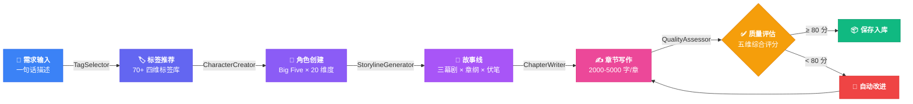
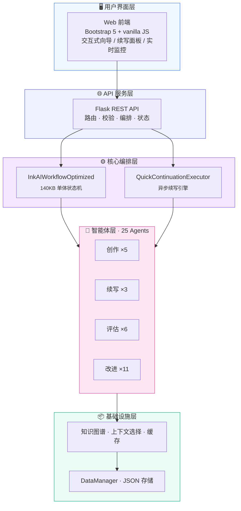

<div align="center">

<br>


**<sup>长篇小说智能创作框架</sup>**

<br>

<a href="#-quick-start"></a>
<a href="#-architecture"></a>
<a href="#-api"></a>

<br>

---

<table align="center"><tr>
<td align="center" width="140"><b>25</b><br><sup>专业 Agent</sup></td>
<td align="center" width="140"><b>5</b><br><sup>创作阶段</sup></td>
<td align="center" width="140"><b>6</b><br><sup>评估维度</sup></td>
<td align="center" width="140"><b>70+</b><br><sup>风格标签</sup></td>
<td align="center" width="140"><b>1000+</b><br><sup>章续航</sup></td>
<td align="center" width="140"><b>MIT</b><br><sup>开源协议</sup></td>
</tr></table>

---

</div>

## 概述

**InkAI** 不是"AI 续写"——它是一个**完整的创作工场**。

输入一句"我想写一本都市悬疑"，25 个专业 Agent 协同运转：分析需求 → 推荐标签 → 塑造角色（Big Five 人格模型）→ 构建三幕故事线 → 写作正文 → 多维度质量评估 → 自动改进。循环往复，直到完成一部逻辑自洽、人物立体、伏笔闭合的长篇小说。

<div align="center">

> *"短篇靠单点爆发，中长篇靠长线闭环"*

</div>

---

## 创作流水线



---

## 系统架构



---

## 智能续写引擎

```mermaid
sequenceDiagram
    autonumber
    participant K as 📚 知识库
    participant S as 🧠 续写故事线
    participant W as ✍ 章节写作
    participant A as 🔍 评估矩阵
    participant I as 🔧 改进引擎

    Note over K,I: 每章一个完整闭环

    W->>K: ① 提取前文状态
    K-->>S: 角色 · 情节 · 伏笔 · 世界观
    S->>S: ② 生成续写故事线
    S-->>W: 章纲 + 事件 + 角色调度
    W->>W: ③ 正文写作
    W-->>A: 2000-5000 字
    A->>A: ④ 六维并行评估
    alt ⑤ 评分 ≥ 80
        A-->>K: 合格 · 保存 · 更新知识库
    else ⑥ 评分 &lt; 80
        A-->>I: 触发专项改进
        I-->>W: 改进后重写
    end
```

<table align="center"><tr>
<td align="center"><b>角色一致性</b><br/><sub>行为 · 语言 · 性格轨迹</sub></td>
<td align="center"><b>情节逻辑</b><br/><sub>因果链 · 漏洞检测</sub></td>
<td align="center"><b>世界观</b><br/><sub>规则一贯 · 设定统一</sub></td>
<td align="center"><b>风格一致</b><br/><sub>语气 · 叙事 · 节奏</sub></td>
<td align="center"><b>读者体验</b><br/><sub>张力 · 共鸣 · 可读性</sub></td>
<td align="center"><b>长期线索</b><br/><sub>跨卷伏笔 · 大结局</sub></td>
</tr></table>

---

## 快速开始

<div id="-quick-start"></div>

```bash
git clone https://github.com/yan2959088709/InkAI-.git && cd InkAI-
pip install -r requirements.txt
```

编辑 `config.py` 填入 API 密钥，然后：

```bash
python start_web.py
# → http://localhost:5000
```

| 配置项 | 说明 |
|------|------|
| `API_KEY` | 智谱 AI GLM-4.5-flash |
| `EMBEDDING_API_KEY` | SiliconFlow BAAI/bge-m3 |
| `BASE_URL` | OpenAI 兼容地址（模型可换） |
| `QUALITY_THRESHOLD` | 质量合格线，默认 80 |

> **兼容性**: Python 3.8+ · Windows / macOS / Linux · 零数据库依赖 · 复制目录即迁移

---

## API

<div id="-api"></div>

所有端点返回统一格式：

```json
{ "ok": true, "data": { } }
{ "ok": false, "error": "..." }
```

<table>
<tr>
<th width="8%">方法</th>
<th width="42%">端点</th>
<th width="50%">功能</th>
</tr>
<tr><td><code>POST</code></td><td><code>/api/novels</code></td><td>创建新小说</td></tr>
<tr><td><code>POST</code></td><td><code>/api/novels/&lt;id&gt;/tags</code></td><td>智能标签推荐</td></tr>
<tr><td><code>POST</code></td><td><code>/api/novels/&lt;id&gt;/characters</code></td><td>创建角色档案</td></tr>
<tr><td><code>POST</code></td><td><code>/api/novels/&lt;id&gt;/storyline</code></td><td>生成三幕故事线</td></tr>
<tr><td><code>POST</code></td><td><code>/api/novels/&lt;id&gt;/chapters</code></td><td>写作第一章</td></tr>
<tr><td><code>POST</code></td><td><code>/api/novels/&lt;id&gt;/continue</code></td><td>启动异步续写</td></tr>
<tr><td><code>GET</code></td><td><code>/api/novels/&lt;id&gt;/continue/status</code></td><td>查询续写进度</td></tr>
<tr><td><code>POST</code></td><td><code>/api/novels/&lt;id&gt;/continue/stop</code></td><td>停止续写</td></tr>
<tr><td><code>GET</code></td><td><code>/api/novels/&lt;id&gt;</code></td><td>获取小说完整数据</td></tr>
<tr><td><code>GET</code></td><td><code>/api/novels/&lt;id&gt;/chapter/&lt;n&gt;</code></td><td>获取指定章节</td></tr>
</table>

---

## 项目结构

<div id="-architecture"></div>

```
InkAI/
│
├── 🤖 agents/                         25 个专业 Agent
│   ├── tag_selector.py                标签推荐
│   ├── character_creator.py           角色创建 (Big Five)
│   ├── storyline_generator.py         三幕故事线
│   ├── chapter_writer.py              章节写作
│   ├── quality_assessor.py            质量评估
│   ├── novel_continuation_agent.py    续写管理器
│   ├── continuation_storyline_*.py    续写故事线
│   ├── continuation_chapter_*.py      续写章节 ± 改进
│   ├── continuation_*_assessor.py     六维一致性评估 ×6
│   └── continuation_*_improver.py     专项改进 ×11
│
├── ⚙ core/                           核心服务
│   ├── core_knowledge_manager.py      知识图谱
│   ├── dynamic_knowledge_manager.py   动态状态追踪
│   └── intelligent_context_selector.py 智能上下文
│
├── 🖥 frontend/                       Web 前端
│   ├── index.html                     Bootstrap 5 SPA
│   ├── app.js                         前端逻辑
│   └── styles.css                     样式
│
├── 📄 app.py                          Flask 服务 (1500 行)
├── 📄 inkai_workflow_optimized.py     核心编排器 (1650 行)
├── 📄 quick_continuation_executor.py  异步续写 (900 行)
├── 📄 data_manager.py                 数据持久化层
├── 📄 workflow_context.py             工作流上下文
├── 📄 base_agent.py                   Agent 基类
├── 📄 config.py                       全局配置
│
└── 💾 data/                          运行时数据
    ├── novels/<uuid>/                 每本小说独立目录
    └── knowledge_graphs/              知识图谱持久化
```

---

<div align="center">

<br>

**InkAI** · AI × 小说创作 · 从创意到成品

<sub>Powered by LLMs · Built with ☕</sub>

<br>


</div>
