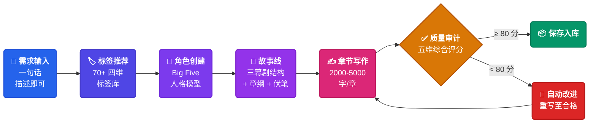
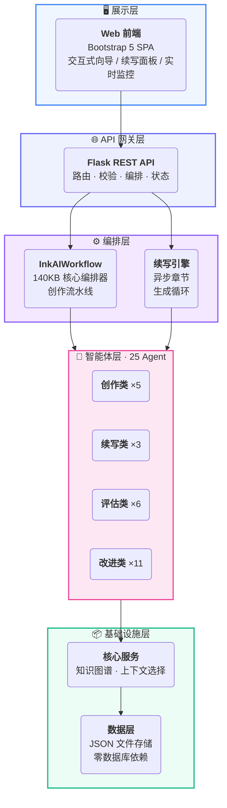
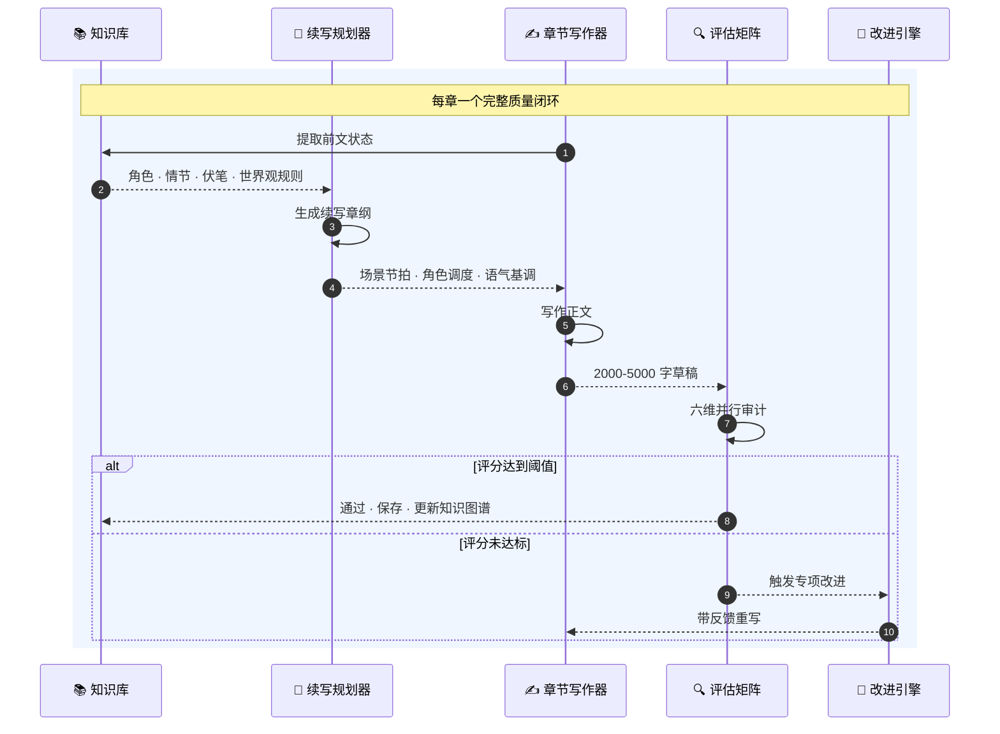

<br>

<div align="center">

<a href="#"></a>

<br>

<a href="README.md"></a>

<br>
<br>

<picture>
  <source media="(prefers-color-scheme: dark)" srcset="https://img.shields.io/badge/AI_%C3%97_%E5%B0%8F%E8%AF%B4%E5%88%9B%E4%BD%9C-25_Agent_%C2%B7_5_%E9%98%B6%E6%AE%B5_%C2%B7_6_%E7%BB%B4%E8%AF%84%E4%BC%B0-3B82F6?style=for-the-badge&labelColor=0F172A" />
  
</picture>

<br>
<br>

<table>
<tr>
<td align="center" width="160"><b style="font-size:28px">25</b><br><sub>专业 Agent</sub></td>
<td align="center" width="160"><b style="font-size:28px">5</b><br><sub>创作阶段</sub></td>
<td align="center" width="160"><b style="font-size:28px">6 维</b><br><sub>质量审计</sub></td>
<td align="center" width="160"><b style="font-size:28px">70+</b><br><sub>风格标签</sub></td>
<td align="center" width="160"><b style="font-size:28px">∞</b><br><sub>无限续写</sub></td>
</tr>
</table>

<br>

<a href="#quickstart"></a>
&nbsp;
<a href="#architecture"></a>
&nbsp;
<a href="#api"></a>

</div>

---

<div align="center">

### &nbsp;&nbsp;🎯 完整的 AI 小说创作工厂&nbsp;&nbsp;

</div>

**InkAI** 不是"AI 续写"工具——它是一个**全栈小说生成框架**。

输入一句话——*"我想写一本都市悬疑"*——25 个专业 AI Agent 应声而动。分析创作意图、推荐题材标签、以 Big Five 人格模型设计有心理深度的角色、构建三幕剧叙事架构、逐章产出 2000-5000 字正文、每章输出经过 6 个维度的质量审计——任何低于 80 分的内容都会被自动重写。最终交付一部逻辑自洽、伏笔闭合、人物弧光完整的长篇小说。

<details>
<summary><b>🇬🇧 English</b></summary>
<br>

**InkAI** is not an "AI autocomplete" tool. It is a full-stack fiction generation framework.

</details>

---



<details>
<summary><b>各阶段详解</b></summary>
<br>

| 阶段 | Agent | 输入 | 输出 |
|------|-------|------|------|
| 🎯 需求 | — | 用户一句话描述 | 创作意图解析 |
| 🏷 标签 | `TagSelectorAgent` | 需求分析 | 四维标签（类型/主题/风格/受众） |
| 👤 角色 | `CharacterCreatorAgent` | 标签 + 需求 | 主角 × 20+ 维度 + 配角群 |
| 📖 故事线 | `StorylineGeneratorAgent` | 角色 + 标签 | 三幕剧 + 章纲 + 伏笔账本 |
| ✍ 写作 | `ChapterWriterAgent` | 故事线 + 角色 | 2000-5000 字正文 |
| ✅ 审计 | `QualityAssessorAgent` | 产出内容 | 五维评分 ≥80 通过 |

</details>

---

<div id="architecture"></div>

<div align="center">

### &nbsp;&nbsp;🏗 系统架构&nbsp;&nbsp;

</div>



---

<div align="center">

### &nbsp;&nbsp;🔄 智能续写引擎&nbsp;&nbsp;

</div>



<table align="center">
<tr>
<td align="center" width="150"><b>角色<br/>一致性</b><br/><sub>行为 · 语言<br/>性格轨迹</sub></td>
<td align="center" width="150"><b>情节<br/>逻辑</b><br/><sub>因果链 · 无漏洞<br/>伏笔闭合</sub></td>
<td align="center" width="150"><b>世界观<br/>连贯</b><br/><sub>规则 · 设定<br/>前后统一</sub></td>
<td align="center" width="150"><b>风格<br/>一致</b><br/><sub>语气 · 叙事<br/>节奏把控</sub></td>
<td align="center" width="150"><b>读者<br/>体验</b><br/><sub>张力 · 共鸣<br/>可读性</sub></td>
<td align="center" width="150"><b>长期<br/>线索</b><br/><sub>跨卷伏笔<br/>大结局追踪</sub></td>
</tr>
</table>

---

<div id="quickstart"></div>

<div align="center">

### &nbsp;&nbsp;⚡ 快速开始&nbsp;&nbsp;

</div>

```bash
git clone https://github.com/yan2959088709/InkAI-.git && cd InkAI-
pip install -r requirements.txt
```

编辑 `config.py` 填入 API 密钥：

```bash
python start_web.py
# → 浏览器打开 http://localhost:5000
```

<table align="center">
<tr>
<td align="center" width="300"><b>API_KEY</b><br/><sub>智谱 AI GLM-4.5-flash</sub></td>
<td align="center" width="300"><b>BASE_URL</b><br/><sub>OpenAI 兼容 · 可换任意模型</sub></td>
<td align="center" width="300"><b>QUALITY_THRESHOLD</b><br/><sub>合格线 · 默认 80/100</sub></td>
</tr>
</table>

> **零基础设施**: 仅需 Python 3.8+。无数据库 · 无 Docker · 复制目录即运行。Windows / macOS / Linux 全平台兼容。

---

<div id="api"></div>

<div align="center">

### &nbsp;&nbsp;🔌 REST API&nbsp;&nbsp;

</div>

所有端点统一返回格式：

```json
{ "ok": true,  "data": { } }
{ "ok": false, "error": "..." }
```

<table>
<tr><th width="10%">方法</th><th width="45%">端点</th><th width="45%">功能</th></tr>
<tr><td><code>POST</code></td><td><code>/api/novels</code></td><td>创建新小说项目</td></tr>
<tr><td><code>POST</code></td><td><code>/api/novels/&lt;id&gt;/tags</code></td><td>AI 智能标签推荐</td></tr>
<tr><td><code>POST</code></td><td><code>/api/novels/&lt;id&gt;/characters</code></td><td>生成角色档案</td></tr>
<tr><td><code>POST</code></td><td><code>/api/novels/&lt;id&gt;/storyline</code></td><td>构建三幕故事线</td></tr>
<tr><td><code>POST</code></td><td><code>/api/novels/&lt;id&gt;/chapters</code></td><td>写作第一章</td></tr>
<tr><td><code>POST</code></td><td><code>/api/novels/&lt;id&gt;/continue</code></td><td>启动异步续写</td></tr>
<tr><td><code>GET</code></td><td><code>/api/novels/&lt;id&gt;/continue/status</code></td><td>查询续写进度</td></tr>
<tr><td><code>POST</code></td><td><code>/api/novels/&lt;id&gt;/continue/stop</code></td><td>停止续写任务</td></tr>
<tr><td><code>GET</code></td><td><code>/api/novels/&lt;id&gt;</code></td><td>获取小说完整数据</td></tr>
<tr><td><code>GET</code></td><td><code>/api/novels/&lt;id&gt;/chapter/&lt;n&gt;</code></td><td>获取指定章节</td></tr>
</table>

---

<div align="center">

### &nbsp;&nbsp;📂 项目结构&nbsp;&nbsp;

</div>

```
InkAI/
│
├── 🤖 agents/                   ── 25 个专业 AI Agent ──
│   ├── tag_selector.py            标签推荐
│   ├── character_creator.py       Big Five 人格角色设计
│   ├── storyline_generator.py     三幕剧叙事架构
│   ├── chapter_writer.py          长篇正文生成
│   ├── quality_assessor.py        多维度质量评分
│   ├── novel_continuation_agent.py 续写编排器
│   ├── continuation_storyline_*.py 逐章情节规划
│   ├── continuation_chapter_*.py  章节写作与改进
│   ├── continuation_*_assessor.py 六维一致性审计
│   └── continuation_*_improver.py 十一类专项修复
│
├── ⚙ core/                     ── 知识与上下文服务 ──
│   ├── core_knowledge_manager.py  基于图谱的知识提取
│   ├── dynamic_knowledge_manager.py 实时状态追踪
│   └── intelligent_context_selector.py 比滑动窗口更聪明
│
├── 🖥 frontend/                 ── Web 界面 ──
│   ├── index.html                 Bootstrap 5 单页应用
│   ├── app.js                     客户端逻辑
│   └── styles.css                 自定义设计系统
│
├── ⚡ app.py                      Flask API 服务 (1,500 行)
├── ⚡ inkai_workflow_optimized.py 核心编排引擎 (1,650 行)
├── ⚡ quick_continuation_executor.py 异步续写循环 (900 行)
├── ⚡ data_manager.py             数据持久化层
├── ⚡ workflow_context.py         状态容器
├── ⚡ base_agent.py               LLM 客户端 · JSON 修复 · 重试
├── ⚡ config.py                   全局配置
│
└── 💾 data/                     ── 运行时存储 ──
    ├── novels/<uuid>/             每本小说独立目录
    └── knowledge_graphs/          持久化图谱快照
```

---

<br>

<div align="center">

<a href="README.md"></a>

<br>
<br>


<br>
<br>

<sub>为创作者而生 · LLM 驱动</sub>

</div>
